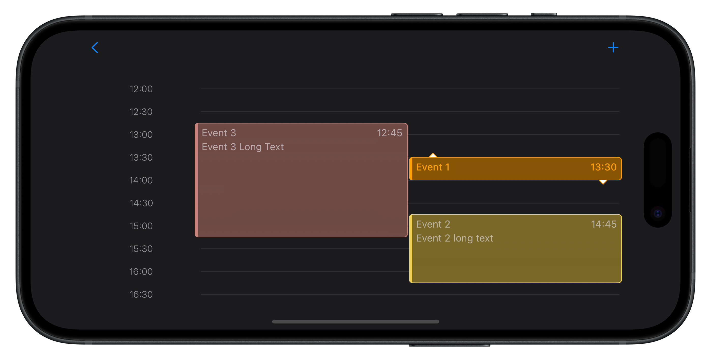

# DayPlannerUI

[](https://github.com/apple/swift-package-manager)

[](https://github.com/fcollf/DayPlannerUI/stargazers)

## Table of Contents

1. [Introduction](#introduction)
   - [Features](#features)
3. [Screenshots](#screenshots)
   - [Portrait View](#portrait-view)
   - [Landscape View](#landscape-view)
4. [Installing](#installing)
5. [Basic Usage](#basic-usage)
6. [Customizing Appearance](#customizing-appearance)
   - [Changing the Selected Color](#changing-the-selected-color)
   - [Changing the Placeholder Color](#changing-the-placeholder-color)
   - [Controlling Interactivity with `isEditable`](#controlling-interactivity-with-isEditable)
7. [Customizing Element Views](#customizing-element-views)
   - [Creating a Custom View for Each Element](#creating-a-custom-view-for-each-element)
8. [Performing Additional Actions](#performing-additional-actions)
   - [Setting Up the Change Handler](#setting-up-the-change-handler)
   - [Adding a Tap Gesture](#adding-a-tap-gesture)
9. [License](#license)

## Introduction

The DayPlannerUI package introduces a user-friendly SwiftUI `DayPlannerView`, inspired by the native Apple Calendar's day view.
It's designed to help users efficiently manage and organize their daily tasks and events.
This package offers seamless interaction, enabling users to dynamically arrange their schedule by
dragging and resizing elements within the planner.

### Features:

* **Customizable Element Appearance**: Tailor the appearance of your planner elements to fit your app's style.
* **Customizable Colors for Selected Elements**: Highlight active items distinctly with customizable color options.
* **Interactive Drag and Resize**: Manage your daily tasks with intuitive drag-and-drop and resizing capabilities.
* **Haptic Feedback**: Feel subtle haptic responses during interactions for a refined user experience.

## Screenshots

Take a look at `DayPlannerView` in action:

### Portrait View
<p float="left">
  
  
</p>


### Landscape View


## Installing

To integrate `DayPlannerUI` into your package, you can add it as a dependency in your `Package.swift` file:

```swift
dependencies: [
    .package(url: "https://github.com/fcollf/DayPlannerUI.git", .upToNextMajor(from: "1.0.0"))
]
```

Alternatively, if you're working on an Xcode project:

1. Open your project in Xcode.
2. Go to File -> Add Package Dependencies....
3. Paste the repository URL: <https://github.com/fcollf/DayPlannerUI>
4. Choose the version you want to use (e.g., Up to Next Major).

Xcode will fetch the latest version of `DayPlannerUI` and integrate it into your project.
Once that is complete, you can start using `DayPlannerUI` by importing it into your Swift code:

```swift
import DayPlannerUI
```
                            
## Basic usage

To utilize `DayPlannerView` in your project, start by ensuring that your event or activity model conforms to the
`SchedulableElement` protocol. This protocol allows `DayPlannerView` to interact with your data.

Here's an example of how to extend your model:
                                
```swift
                            
import DayPlannerUI

struct MyEvent: SchedulableElement {
    
    /// Unique identifier for the event
    var id: UUID
    
    /// Title of the event
    var title: String
    
    /// Start time of the event
    var startTime: Date
    
    /// Duration of the event (minutes)
    var duration: Int

    ...
}
                            
```

After your model conforms to `SchedulableElement`, you can initialize and use `DayPlannerView` in your SwiftUI views.
Here's a basic example using the default event visualization and colors:
                                
```swift
                            
import DayPlannerUI
import SwiftUI


struct ContentView: View {
    
    /// Your array of events
    @State var events: [MyEvent] = []
    
    /// The event currently selected by the user
    @State var selectedEvent: MyEvent?

    var body: some View {
        DayPlannerView(elements: events, selection: $selectedEvent)
    }
}
```

## Customizing Appearance

`DayPlannerView` offers flexibility in customizing the appearance of selected events and placeholder elements.
You can use the provided view modifiers to easily change the selected color and placeholder color.

### Changing the Selected Color

To change the color of the selected element, use the `.foregroundStyle(selection:)` modifier on `DayPlannerView`:

```swift
DayPlannerView(elements: events, selection: $selectedEvent)
    .foregroundStyle(selection: .blue)
```

### Changing the Placeholder Color

When an event is being dragged, a placeholder view is shown. You can change the color of this placeholder view 
to indicate that it's a temporary state:

```swift
DayPlannerView(elements: events, selection: $selectedEvent)
    .foregroundStyle(placeholder: .indigo)
```

This modifier changes the color of the placeholder view that appears when you're dragging an element.

### Controlling Interactivity with `isEditable`

`DayPlannerView` allows you to control whether the planner elements are editable (movable and resizable) 
by using the `isEditable` modifier. This can be particularly useful if you want to switch between editable 
and read-only modes based on certain conditions in your app.

To make your `DayPlannerView` read-only, simply apply the `isEditable` modifier with `false`:

```swift
DayPlannerView(elements: events, selection: $selectedEvent)
    .isEditable(false)
```

## Customizing Element Views

`DayPlannerView` allows you to fully customize the presentation of each element,
letting you to control not just the colors, but the entire layout and interactivity of your events or
tasks. This customization is achieved through the `ElementBuilder` closure, which you provide when initializing
your `DayPlannerView`. The `ElementBuilder enables you to define precisely how each element in the planner should be visualized.

### Creating a Custom View for Each Element

To define a custom appearance and behavior for your planner elements, follow these steps:
                                                    
#### 1. Define Your Custom Element View
                                    
Create a SwiftUI view that represents how you want each element in the planner to appear. 
Ensure your view expands to fill the available space by setting the frame to maximum width 
and height. This view can include text, images, shapes, animations, and more to suit 
your application's needs.

For more dynamic and size-adaptive layouts, consider using `ViewThatFits` to provide different 
view presentations based on the available space, especially useful when elements are resized.

Here's a basic template for a custom element view:
                                    
```swift
import SwiftUI

struct CustomElementView: View {
    
    var startTime: Date
    var element: MyEvent
    var isPlaceholder: Bool
    var isSelected: Bool
    
    var body: some View {
        
        ViewThatFits {
        
            // Layout for smaller size
            VStack {
                
            }
            
            // Layout for larger size
            VStack {
                Text(element.title)
                Text(element.subtitle)
                    .font(.footnote)
                
                // Add more views as needed
            }
        }
        .frame(maxWidth: .infinity, maxHeight: .infinity) // Makes the view fill the available space

        // Apply styling based on the `isSelected` state or any other logic
    }
}
```

In this custom view, `.frame(maxWidth: .infinity, maxHeight: .infinity)` ensures the view 
expands to fill the available space, making it responsive to resizing gestures. `ViewThatFits` 
is used to adapt the view's layout based on the available space, enhancing the visual 
coherence during resizing.

#### 2. Utilize Your Custom Element View in `DayPlannerView`:

When initializing `DayPlannerView`, use the `ElementBuilder` closure to return an instance of your
custom element view for each element. The closure provides the context for each element, including
its data and state, allowing your custom view to react and display accordingly.

Here's how you use your custom element view with `DayPlannerView`:
                                
```swift

DayPlannerView(elements: events, selection: $selectedEvent) { startTime, element, isPlaceholder, isSelected in
    CustomElementView(startTime: startTime, element: element, isPlaceholder: isPlaceholder, isSelected: isSelected)
}

```
                
## Performing Additional Actions

`DayPlannerView` allows you to perform custom actions in response to changes in planner elements,
such as moving or resizing an element. This functionality is enabled through the `onChange` closure,
which is invoked whenever an element is modified.

### Setting Up the Change Handler

To react to changes in your planner elements, define a `ChangeHandler` and pass it to your `DayPlannerView` during initialization.
This handler receives the modified element as a parameter, allowing you to execute any additional logic, such as updating your data
source or triggering side effects.

Here's how you can set up and use the `onChange` closure:

When using a custom element view:

```swift

DayPlannerView(elements: events, selection: $selectedEvent) { startTime, element, isPlaceholder, isSelected in
    CustomElementView(startTime: startTime, element: element, isPlaceholder: isPlaceholder, isSelected: isSelected)
} onChange: { element in
    // Perform addtional actions
}

```

And when using the default visualization:
            
```swift
    DayPlannerView(elements: events, selection: $selectedEvent) { element in
        // Perform addtional actions
    }
    .foregroundStyle(selection: .indigo)
```

In both cases, the `onChange` closure provides a way to react to user interactions, ensuring
that your application can dynamically respond to changes in the day planner.

### Adding a Tap Gesture

`DayPlannerView` also supports tap gestures on elements, enabling you to define custom actions when 
an element is tapped. This is achieved through the `onTapGesture` modifier, which assigns a closure 
to be called whenever an element receives a tap gesture.

```swift
   DayPlannerView(elements: events, selection: $selectedEvent) { element in
      // Perform addtional actions
   }
   .isEditable(false)
   .onTapGesture { element in
      print("Tapped element: \(element.title)")
   }
```

In this example, the `onTapGesture` closure prints the tapped element's details to the console, 
but you can replace this with any custom behavior you need for your application.

> [!Note]
> The tap gesture is only recognized when the `DayPlannerView` is in non-editable mode. If the view is
> set to editable mode (allowing users to select, drag or resize elements), the tap gesture won't be active.
> To use the tap gesture, ensure that the view is in non-editable mode by setting the `isEditable` property to `false`.

## License

This package is licensed under the MIT License - see the [LICENSE](LICENSE) file for details
